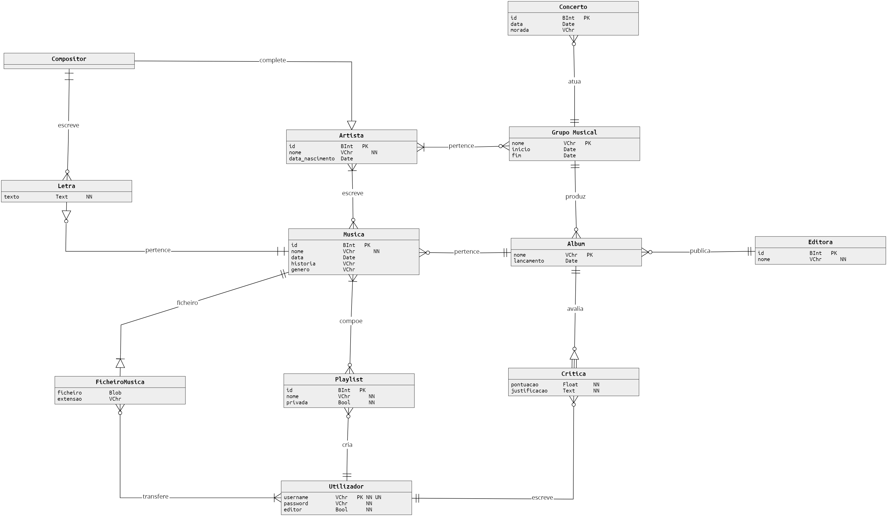
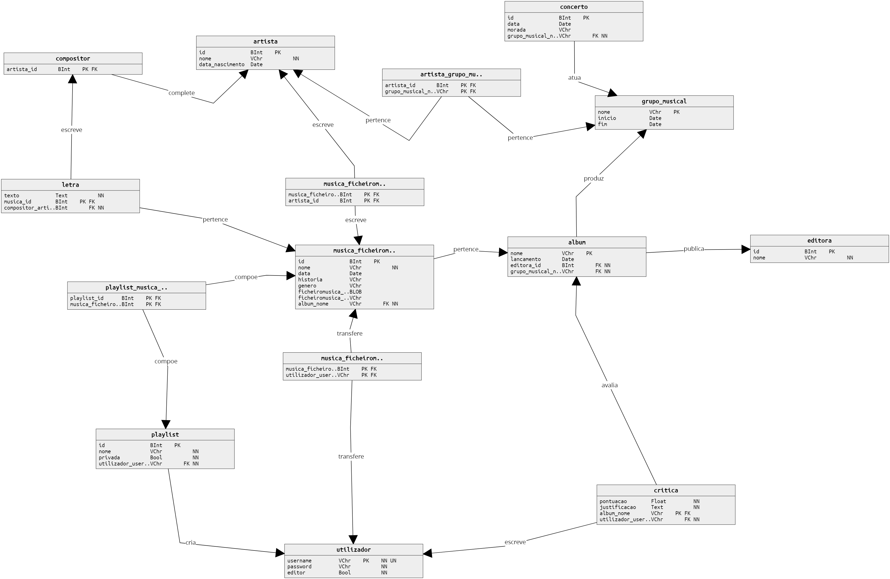

# Projecto Base de Dados
## Relatório Meta 2 (28 Novembro 2018)

## Contactos

| Nome | Email | Número de Estudante | 
|:---|---:|:---|
| Alexandre Faria | afaria@student.dei.uc.pt | 2014226180 |
| Carlos Poiares | cpoiares@student.dei.uc.pt | 2014226236 |


## Table of Contents
1. [Contactos](#Contactos)
2. [Instalação](#Instalação)
3. [Estrutura do código](#Estrutura)
4. [Funcionalidades](#Funcionalidades)
    1. [Registo](#Registo)
    2. [Login](#Login)
    3. [Músicas](#Musicas)
5. [Diagramas](#Diagramas)
    1. [Diagrama Conceptual](#Conceptual)
    2. [Diagrama Físico](#Físico)


## Instalação

O projeto foi feito para python 3.

A configuração da ligação com a base de dados está definida em `config.py`

Instruções para correr o projecto. O único módulo externo utilizado é o `psycopg2` para a comunicação com a base de dados Postgresql.

```bash
$ python3 -m venv venv
$ source venv/bin/activate
$ pip install -r requirements.txt
$ python3 -m bdcringe.main
```

<div class="page-break"></div>

## Utilização

### Menu de Login / Registo de conta

```
1. Register
2. Login
3. Leave
> 
```

### Menu Principal

As opções marcadas com `[E]` estão restritas a utilizadores com privilégios de editor.

```
0. [E] Inserir editora.
1. [E] Tornar editor.
2. [E] Inserir Artista.
3. Gestão de grupos musicais.
4. Gestão de albuns.
5. Procurar artista.
6. Listar musicas de um artista.
7. Listar editoras.
8. Sair
> 
```

### Menu de gestão de grupos músicais

Como um albúm tem que estar necessariamente associado a um grupo musical, a inserção
de um novo albúm é feito após pesquisa e seleçao de um grupo musical.

```
Gestão de grupos
0. Listar grupos.
1. [E] Inserir novo grupo.
2. Procurar grupo.
3. Sair
> 2
Procurar grupo.
Nome: Roll
0. (2010-01-02 até 2010-10-01) Rolling Stones
1. Sair
> 0
0. Listar artistas do grupo.
1. [E] Adicionar artista.
2. [E] Adicionar albúm.
3. [E] Adicionar concerto.
4. Listar Concertos.
5. Sair.
> 
```

<div class="page-break"></div>

### Menu de gestão de albuns

```
Gestão de albums.

0. Listar albums.
1. Procurar album.
2. Sair
> 1
Procurar album.
Nome: Dark
0. Pink Floyd - Dark Side of the Moon
1. Sair
> 0
0. Listar musicas.
1. [E] Adicionar musica.
2. Escrever critica.
3. Listar criticas.
4. Sair.
>
```

<div class="page-break"></div>

## Estrutura

O código da aplicação foi separado em 2 modulos python principais `database` e `menus`.

O módulo `database` contém vários submodulos que servem camada de abstração entre a interface do utilizador e o sql
utilizado para as operações com a base de dados.

O módulo `menus` contém os menus para a interface de linha de comandos

Esta estrutura torna a transição para uma interface gráfica mais fácil.

```bash
├── __init__.py
├── config.py
├── main.py
├── database
│   ├── __init__.py
│   ├── albums.py
│   ├── artists.py
│   ├── groups.py
│   ├── labels.py
│   ├── playlists.py
│   ├── songs.py
│   └── user.py
└── menus
    ├── __init__.py
    ├── albums.py
    └── groups.py
```

<div class="page-break"></div>

## Funcionalidades

### Registo

Insere na base de dados um novo utilizador com o username e password fornecidos.
Dá erro de inserção caso já exista algum utilizador com o mesmo username devido ao campo `username`
servir de chave primária (unique).

`bdcringe.database.user.register(username, password)`

```sql
INSERT
INTO
    utilizador
    (username, password)
VALUES
    (%s, %s)
returning
    username, editor
```

### Login

`bdcringe.database.user.login(username, password)`

Dado um nome e password de um utilizador, verifica se existe na base de dados.
```sql
SELECT
    username, editor
FROM
    utilizador
WHERE
    username LIKE %s and
    password LIKE %s
```

<div class="page-break"></div>

### Promover utilizador a editor

Para promover outro utilizador a editor são necessárias duas operações, uma de pesquisa e uma de atualização.

##### Procurar utilizador

É feita uma listagem de utilizadores sem permissoes de editor com base no nome a procurar para tornar a procura mais fácil para o utilizador.

`bdcringe.database.user.search(username)`

```sql
SELECT
    nome
FROM
    utilizador
WHERE
    username LIKE %%s% and
    editor = false
```


##### Tornar editor
A partir do username introduzido pelo utilizador altera os seus privilégios de editor.

`bdcringe.database.user.make_editor(username)`

```sql
UPDATE
   utilizador 
SET
   editor = true 
WHERE
   nome LIKE '%s'
```

<div class="page-break"></div>

### Procurar Artista

Dado um nome de um artista é retornada toda a informação relativa ao artista em questão, retorna erro no caso do artista não existir.

`bdcringe.database.artists.search(nome)`

```sql
SELECT
    * 
FROM
    artista
WHERE
    nome LIKE '%s'
```

### Listar as músicas de um Artista

Dado um nome de um artista, devolve todas as músicas dele

`bdcringe.database.artists.get_songs(nome)`

```sql
SELECT
    nome,
    data,
    historia
FROM
    musica,
    musica_artista
WHERE
    artista_id = (
        SELECT
            id 
        FROM
            artista 
        WHERE
            nome LIKE '%s'
    ) and
    musica_id = id
```

<div class="page-break"></div>

### Inserir um Album

Dado um nome, uma data de lançamento válida, um nome de grupo musical e o nome da editora correspondente, insere um novo album.
O id da editora é obtido através de uma subconsulta.

`bdcringe.database.albums.insert(nome, lancamento, grupo_musical, editora)`

```sql
INSERT
    INTO
        album
        (nome, lancamento, editora_id, grupo_musical_nome)
        SELECT
            %s,
            %s,
            id,
            %s
        FROM
            editora
        WHERE
            nome LIKE %s
```

### Procura de um Album
Dado um nome de um album devolve toda a sua informação.

`bdcringe.database.albums.search(nome)`

```sql
SELECT
    *
FROM
    album
WHERE
    nome LIKE %(like)s ESCAPE '='
```

### Alterar o nome de um Album

Dado um nome original e um novo nome, procura e altera o album.

`bdcringe.database.albums.update_nome(antigo, novo)`

```sql
UPDATE
    album
SET
    nome = %s
WHERE
    nome LIKE %s
```

<div class="page-break"></div>

### Apagar um album

Dado o nome de um album, remove-o da base de dados.

`bdcringe.database.albums.delete(nome)`

```sql
DELETE
    FROM
        album
    WHERE
        nome LIKE %s
```

### Listar músicas de um album


Dado um nome de um album, devolve todas as músicas a que ele pertencem.

`bdcringe.database.albums.songs(nome)`

```sql
SELECT
    *
FROM
    musica
WHERE
    album_nome LIKE %s
```


<div class="page-break"></div>

## Criticas


### Escrever uma crítica a um album

É pedido ao utilizador uma pontuaçao e uma justificação textual para essa pontuação e é registada na tabela de críticas.

`bdcringe.database.albums.review(nome, pontuacao, justificacao, username)`

```sql
INSERT
    INTO
        critica
        (album_nome, utilizador_username, pontuacao, justificacao)
    VALUES
        (%s, %s, %s, %s)
```

### Mostrar todas as críticas de um album

Dado um nome de um album, mostra todas as suas críticas.

`bdcringe.database.albums.reviews(nome)`

```sql
select
    pontuacao, justificacao, utilizador_username
from
    critica
where
    album_nome like %s
```

<div class="page-break"></div>

### Inserir Editora

Dado um nome, insere uma nova editora na base de dados.

`bdcringe.database.labels.insert(nome)`

```sql
INSERT
    INTO
        editora
        (nome)
    VALUES
        (%s)
```

### Procurar Editora

Dado um nome devolve toda a informação relativa a essa editora.

`bdcringe.database.labels.search(nome)`

```sql
SELECT
    *
FROM
    editora
WHERE
    nome LIKE %%s%
```

### Alterar o nome de uma editora

Dado um nome original e um novo nome, procura e altera a editora.

`bdcringe.database.labels.update(antigo, novo)`

```sql
UPDATE
    editora
SET
    nome = %s
WHERE
    nome LIKE %s
``` 

### Remover Editora

Dado o nome de um album, remove-o da base de dados.

`bdcringe.database.labels.delete(nome)`

```sql
DELETE
FROM
    editora
WHERE
    nome LIKE %s
```

### Listar editoras

Lista todas a editoras existentes.

`bdcringe.database.labels.get_all()`

```sql
SELECT
    *
FROM
    editora
```


### Inserir Grupo Musical
Dado um nome, data de inicio e data de fim, insere um novo grupo musical.

`bdcringe.database.groups.insert(nome, inicio, fim)`

```sql
INSERT
    INTO
        grupo_musical
        (nome, inicio, fim)
    VALUES
        (%s, %s, %s)
```

<div class="page-break"></div>

### Adiciona Artista ao Grupo Musical
Dado o id do artista e o nome do grupo musical, insere o artista um novo artista_grupo_musical.

`bdcringe.database.groups.add_artist_id(id_artista, grupo)`

```sql
INSERT
    INTO
        artista_grupo_musical
        (artista_id, grupo_musical_nome)
        SELECT
            %s,
            nome
        FROM
            grupo_musical
        WHERE
            nome like %s
```

### Listar membros de um Grupo Musical
Dado um nome do grupo musical, lista todos os artista presentes no grupo.
A pesquisa é feita através do id do grupo_musical(nome) na tabela de artista_grupo_musical, 
listando toda informação dos artistas associados ao id do grupo_musical(nome).

`bdcringe.database.groups.members(nome)`

```sql
SELECT
    *
FROM
    artista a,
    artista_grupo_musical agm
WHERE
    a.id = agm.artista_id ands
    agm.grupo_musical_nome like %s
```
 
### Insere Música
Este processo é feito em dois passos, criando uma entrada na tabela musica e criando posteriormente uma entrada na tabela musica_artista.

`bdcringe.database.songs.insert(nome, data, historia, genero, album, id_artist)`

#### Criar Musica e inserir na base de dados
Dado um nome da música, uma data de criação válida, um resumo breve da história, género, e nome do album cria uma nova música.


```sql
INSERT 
    INTO
        musica
        (nome, data, historia, genero, album_nome) 
    VALUES
        ('%s', '%s', '%s', '%s', '%s')
```

<div class="page-break"></div>

#### Associar a música a um artista
Dado o nome do artista a quem está associada a música, associa a música ao artista através da tabela musica_artista.
A associação é feita através dos identificadores, o que é devolvido pela subconsulta.

```sql
INSERT 
    INTO
        musica_artista
        (artista_id, musica_id)
        SELECT
            a.id,
            m.id
        FROM
            artista a,
            musica m
        WHERE
            m.nome LIKE '%s' and
            a.nome LIKE '%s'
```
### Procurar Música
Dado um nome é retornada toda a informação geral e a lista de artistas de cada música encontrada.

`bdcringe.database.songs.search_name(nome)`

```sql
SELECT
    m.nome,
    m.data,
    m.historia,
    m.genero,
    a.nome,
    a.data_nascimento
FROM
    artista a,
    musica_artista ma,
    musica m
WHERE
    a.id = ma.artista_id
    and m.id = ma.musica_id
    and m.nome LIKE '%%s%'
```


### Adicionar uma letra a uma música

Dado o id do compositor (artista), o id da música e a letra, insere uma nova letra na tabela.

`bdcringe.database.songs.letra(musica, compositor, texto)`

```sql
INSERT
INTO
    letra
    (texto, musica_id, compositor_artista_id) 
VALUES
    (%s, %s, %s)
```

<div class="page-break"></div>

## Diagramas

#### Conceptual


<div class="page-break"></div>

#### Físico
